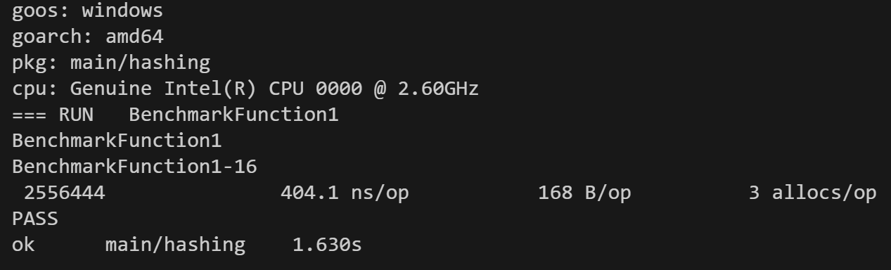
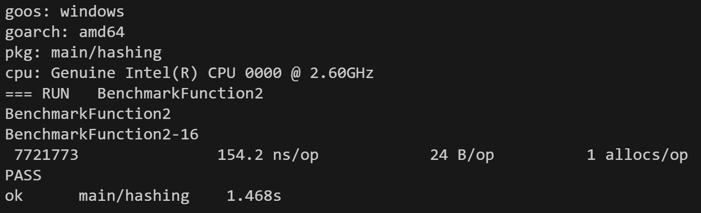

# Реализация SHA-1 Hashing Algorithm с помощью языка Go

## Описание
Этот проект представляет собой реализацию алгоритма хеширования SHA-1 на языке программирования Go. Он разработан для демонстрации понимания принципов криптографического хеширования и работы с битовыми операциями в Go.

## Установка
Чтобы использовать этот проект, склонируйте репозиторий с помощью Git:

```git clone https://github.com/Joroboro253/hashing-algorithm.git```

Затем перейдите в каталог проекта:

cd hashing-algorithm


## Использование
Для использования алгоритма SHA-1 в вашем проекте на Go, импортируйте пакет и вызовите функцию `MyOwnSha`:
```go
import "hashing-algorithm/hashing"

func main() {
    message := "Ваше сообщение"
    hash := hashing.MyOwnSha([]byte(message))
    fmt.Printf("SHA-1 Hash: %x\n", hash)
}
```

## Тестирование
Вы можете запустить тесты, чтобы убедиться в корректности реализации:

```go test ./hashing -v```

## Сравнение производительности Реализаций SHA-1

Для сравнения производительности с стандартной библиотекой Go, запустите бенчмарки:


1. Запуск бенчмарка для моей реализации SHA-1 алгоритма:

```go test -v -bench=BenchmarkFunction1 ./hashing```

2. Запуск бенчмарка для теста библиотечной версии SHA-1 алгоритма:
   
```go test -v -bench=BenchmarkFunction2 ./hashing```


### Время выполнения собственной реализации SHA-1


### Время Выполнения Библиотечного Алгоритма SHA-1


### Вывод
Библиотечная реализация оказалась более оптимизированная по затраченным ресурсам и по времени выполнения. Моя реализация SHA-1 работает медленнее и использует больше памяти (415.7 нс/оп, 168 байт на операцию) по сравнению с библиотечной реализацией (BenchmarkFunction2, 149.9 нс/оп, 24 байта на операцию).

Библиотечная реализация оказалась более эффективной, что ещё раз доказывает преимущество использования библиотек, перед собственной реализацией функций.